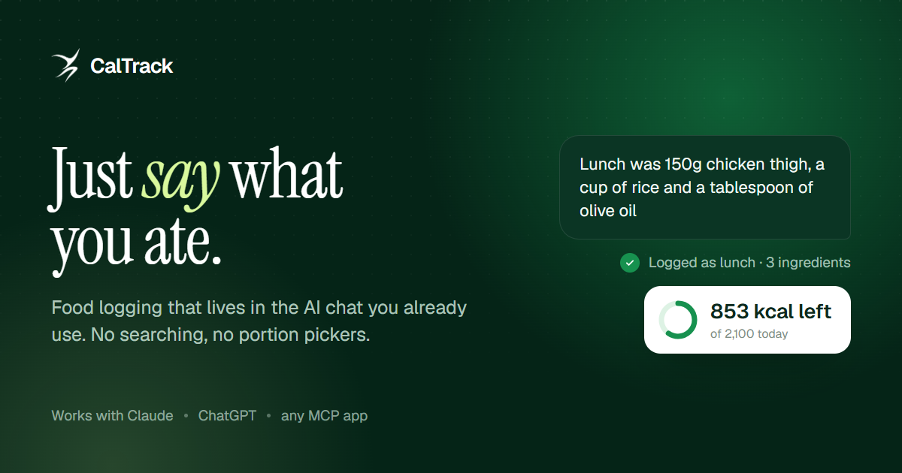
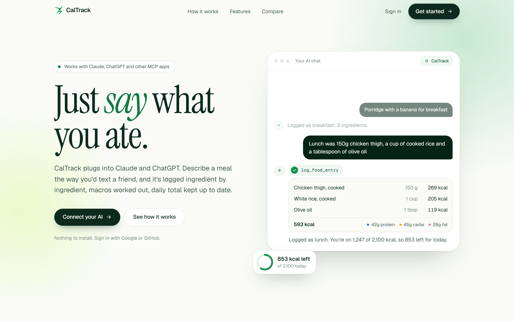

<p align="center">
  
</p>

<h1 align="center">CalTrack</h1>

<p align="center"><b>Nutrition tracking that lives inside the AI chat you already use.</b></p>

<p align="center">
  <a href="#connect-an-ai-app">Connect an AI app</a> ·
  <a href="#run-your-own">Run your own</a> ·
  <a href="#the-tools">The tools</a> ·
  <a href="docs/spec.md">Spec</a>
</p>

---

Most food apps turn a meal into data entry: search a database, scroll past forty versions of "chicken thigh", work out whether the label meant raw or cooked, guess the portion, repeat for the rice and the oil you nearly forgot. Most food logs go quiet within a fortnight.

CalTrack replaces all of that with a sentence.

> **You** — Lunch was 150g chicken thigh, a cup of rice and a tablespoon of olive oil
>
> **Claude** — Logged as lunch: chicken thigh 269 kcal, white rice 205 kcal, olive oil 119 kcal. That's 593 kcal, 42g protein. You're on 1,247 of 2,100 today, so 853 left.

It's a [Model Context Protocol](https://modelcontextprotocol.io) server, so it plugs into Claude, ChatGPT or any MCP-capable app as a connector. A web dashboard comes with it for the days you'd rather look than ask.



## What it does

- **Logs meals from plain language**, ingredient by ingredient, with calories, protein, carbs, fat, fibre and sugar per item. If a portion is unclear, it asks instead of guessing.
- **Saved meals** — "same lunch as Tuesday" copies a whole meal exactly, rather than rebuilding it.
- **Barcodes** — packaged food is looked up through [Open Food Facts](https://world.openfoodfacts.org).
- **Targets worked out from your stats** — Mifflin-St Jeor resting burn with an activity multiplier, weekly pace capped at about 1% of bodyweight, never dipping below 1.2× resting burn. You can override calories or macros by hand and the override sticks.
- **Weight, water and trends** over 7, 30 or 90 days.
- **A dashboard** showing today's meals, macro progress, the week at a glance, and charts.
- **Days that respect your timezone**, so a late dinner lands on the right date wherever you are.
- **Your data stays yours** — download the lot as JSON, or delete the account outright, from the dashboard or by asking your AI.

## How it works

```
  Claude / ChatGPT / any MCP app
            │
            │  MCP over HTTP, OAuth 2.1 + Dynamic Client Registration
            ▼
  ┌─────────────────────────────┐
  │  CalTrack server (Express)  │────►  Supabase Postgres
  │  · OAuth authorization      │       · row-level security per user
  │  · 33 MCP tools             │       · totals computed by triggers
  │  · serves the web app       │
  └─────────────────────────────┘
            ▲
            │  Google / GitHub sign-in
            │
  Dashboard (React, Vite, Tailwind)
```

A few decisions worth calling out:

- **The server is its own OAuth 2.1 authorization server**, including Dynamic Client Registration, so any MCP client can connect on its own without hand-made API keys. Identity comes from Supabase Auth (Google or GitHub); CalTrack then issues its own scoped tokens to the AI app.
- **Every table is locked to `auth.uid()`** through row-level security. The dashboard talks to Supabase directly with a public key and still can't read a row that isn't yours. The server holds the service key and filters by user on every query.
- **Meal totals are computed by Postgres triggers** from the ingredient rows, so a meal's calories can never drift from the ingredients that make it up.
- **The MCP endpoint is stateless** — a fresh server and transport per request, nothing held in memory, so a restart or a second instance changes nothing.
- **Two entry points, one set of tools.** `index.ts` runs over stdio for a local Claude Desktop extension; `server-http.ts` runs the hosted version. Both register the same tools from `tools.ts`.

## Connect an AI app

The server address is your deployment's URL with `/mcp` on the end.

**Claude** — Settings → Connectors → Add custom connector → paste the URL → Connect → sign in with Google or GitHub → Allow.

**ChatGPT** — Settings → Apps & Connectors → Advanced → enable Developer mode → create a connector with the same URL and OAuth sign-in.

**Claude Code**

```bash
claude mcp add --transport http caltrack https://your-caltrack-host/mcp
```

Then start with "Set up my CalTrack profile" and it will ask for what it needs.

## Run your own

You'll need Node 24 and a free [Supabase](https://supabase.com) project.

**1. Install**

```bash
git clone https://github.com/ayaanmsaif/CalTrack-MCP.git
cd CalTrack-MCP
npm install --prefix mcp-server
npm install --prefix web
```

**2. Set up the database**

Run every file in `supabase/migrations/` in order, through the Supabase SQL editor or `supabase db push`.

**3. Turn on sign-in**

In Supabase, under Authentication → Sign In / Providers, enable Google and/or GitHub. Each provider's callback URL is `https://<your-project>.supabase.co/auth/v1/callback`. Under URL Configuration, add `https://<your-host>/**` to the redirect list.

**4. Configure**

Create `mcp-server/.env`:

```ini
SUPABASE_URL=https://<your-project>.supabase.co
SUPABASE_SECRET_KEY=<service role / secret key>
SUPABASE_ANON_KEY=<publishable key>
BASE_URL=http://localhost:8080
SESSION_SECRET=<random string>
```

**5. Run it**

```bash
npm run build --prefix web        # or: npm run dev --prefix web
npm run dev:http --prefix mcp-server
```

The landing page, dashboard and MCP endpoint are all served from `http://localhost:8080`.

**6. Deploy**

`render.yaml` describes a single [Render](https://render.com) web service that builds the web app and the server together. Point Render at the repo, fill in the same environment variables, set `BASE_URL` to the assigned address, and add that address to Supabase's redirect list.

For a local, single-user setup with no OAuth at all, `mcp-server/src/index.ts` runs the same tools over stdio using a `CALTRACK_USER_ID` from the environment.

## The tools

<details>
<summary><b>33 tools</b></summary>

**Logging** — `log_food_entry`, `update_food_entry`, `delete_food_entry`, `get_meals_today`, `get_meals_by_date`, `get_meals_by_date_range`, `search_meals`

**Saved meals** — `create_saved_meal`, `log_saved_meal`, `update_saved_meal`, `delete_saved_meal`, `search_saved_meals`, `list_saved_meals`

**Profile and goals** — `set_profile`, `get_profile`, `set_goals`, `get_goals`, `get_goal_progress`, `get_goal_history`, `set_calorie_override`, `set_macro_override`, `recalculate_targets`

**Weight, water and trends** — `log_weight`, `get_weight_trends`, `log_water`, `get_water_today`, `get_nutrition_summary`, `get_trends`

**Everything else** — `lookup_barcode`, `set_timezone`, `export_all_data`, `delete_account`, `ping`

</details>

## Layout

```
mcp-server/     Express server, MCP tools, OAuth 2.1 provider and sign-in pages
web/            Landing page and dashboard (React, Vite, Tailwind, Motion)
supabase/       Schema, row-level security policies and seed data
docs/spec.md    The full product and technical spec
render.yaml     One-service deployment blueprint
```

## Notes

Nutrition figures are estimates produced by a language model, not measurements, and nothing here is medical or dietary advice.

On free hosting tiers the server sleeps when idle, so the first request after a quiet spell can take about a minute to answer.
